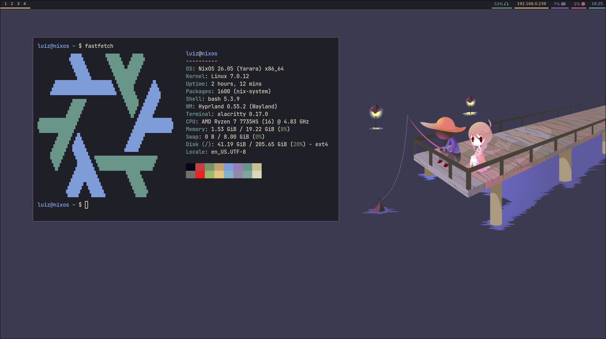
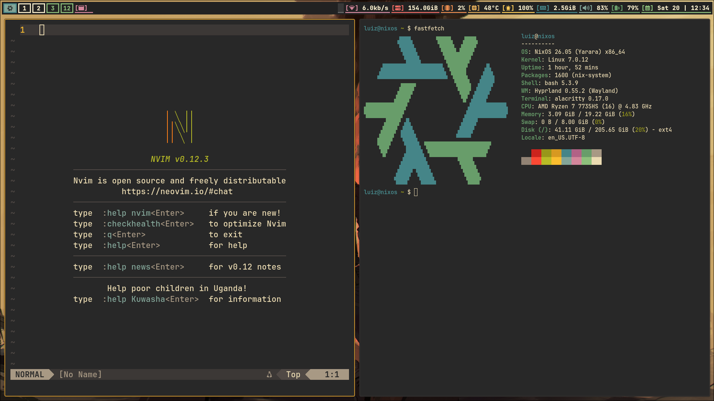
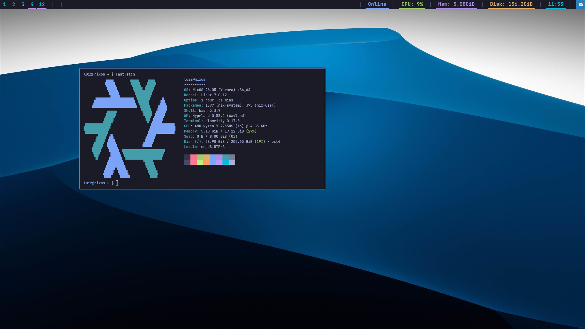
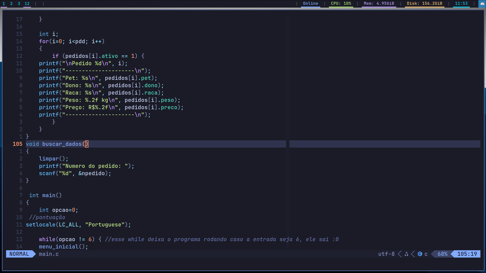

# Σ | Dotfiles

*"My personal Linux configurations."*

  
  
  
  
  
  
  

---

## 🛠 | Applications

- **Terminal:** Alacritty
- **Launcher:** Fuzzel
- **Editor:** Neovim
- **Bar:** Waybar

---

## 🎨 | Themes

  
<strong>🌊 Kanagawa</strong>

   

  

   

  - Alacritty
  - Fuzzel
  - Neovim
  - Waybar

  
<strong>🌲 Gruvbox</strong>

   

  

   

  - Alacritty
  - Fuzzel
  - Neovim
  - Waybar

  
<strong>🌃 Tokyo Night</strong>

   

  

  

   

  - Alacritty
  - Fuzzel
  - Neovim
  - Waybar

